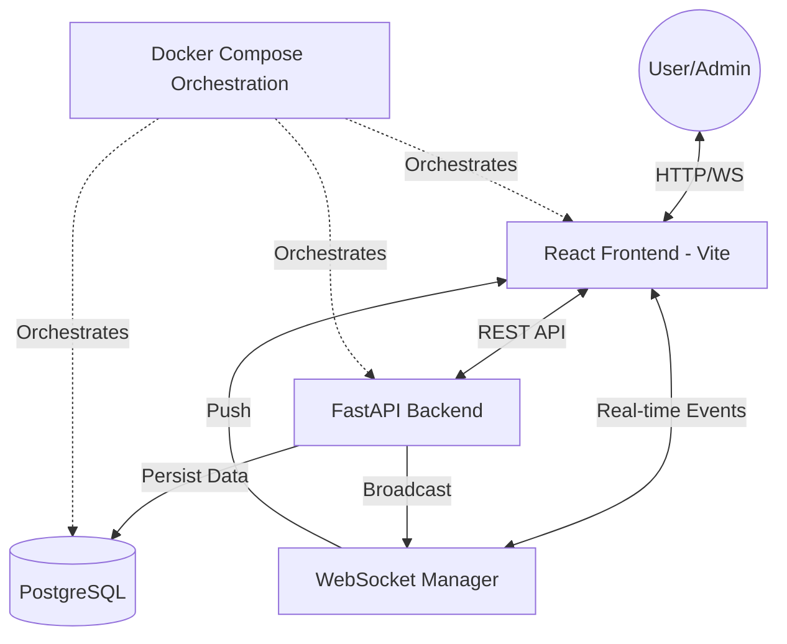

# Notification Hub - Architecture & Implementation

## 1. System Overview
The Notification Hub is a real-time, **fully containerized** communication system designed for organizational alerts. It allows administrators to dispatch targeted notifications (to all users or specific roles) delivered instantly via WebSockets. The system follows a **Domain-Driven Design (DDD)** approach and is orchestrated using **Docker Compose** for a seamless, production-ready environment.

### 1.1 Component Connection Diagram

---

## 2. Notification Lifecycle
Trace of a complete flow: **"Admin notifies Managers about a 10,000 BDT budget adjustment."**

1.  **Request**: Admin uses the **Admin Panel** to send a message. The React frontend sends a `POST` request to `/api/v1/notifications`.
2.  **Persistence**: The FastAPI backend receives the request, validates it via **Pydantic**, and saves the notification to the `notifications` table.
3.  **Mapping**: The backend identifies all users with the "Manager" role and creates entries in the `user_notifications` join table with `is_read=False`.
4.  **Broadcast**: The **WebSocket Manager** identifies active connections for the target users and pushes a JSON payload containing the new notification.
5.  **UI Update**: The Manager's frontend receives the event, triggers a local state update, and increments the **Unread Badge** without a page refresh.

---

## 3. Database Schema Design
The system utilizes 3 core tables to manage notifications and user states:

### 3.1 `roles` & `users`
- **`roles`**: `id` (INT), `name` (VARCHAR - Admin, Manager, etc.)
- **`users`**: `id` (INT), `username` (VARCHAR), `role_id` (FK)

### 3.2 `notifications`
- **`id`**: INT (Primary Key)
- **`title`**: VARCHAR
- **`message`**: TEXT
- **`created_at`**: DATETIME

### 3.3 `user_notifications` (The Junction)
- **`user_id`**: FK (INT)
- **`notification_id`**: FK (INT)
- **`is_read`**: BOOLEAN (Default: False)
- **`received_at`**: DATETIME

---

## 4. Tech Stack & Infrastructure
- **Orchestration**: **Docker Compose** (PostgreSQL, Backend, Frontend).
- **Backend**: FastAPI (Async support), SQLAlchemy (ORM), Pydantic (Validation).
- **Frontend**: React (Hooks), Radix UI (Primitives), Vanilla CSS (Premium Glassmorphism).
- **Design Pattern**: Domain-Driven Design (DDD).

---

## 5. Setup & Running
The entire system is orchestrated for a one-command setup:

1. Clone the repository.
2. Run `docker compose up --build`.
3. Access the dashboard at `http://localhost:3000`.
